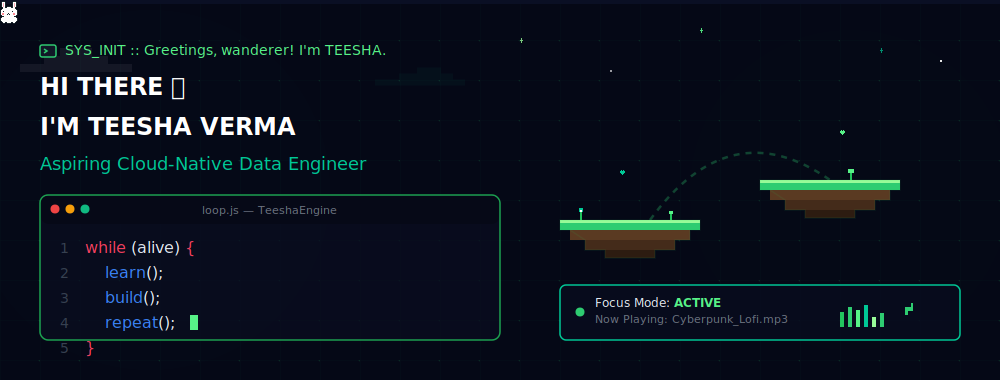
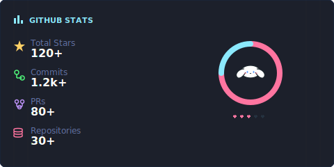
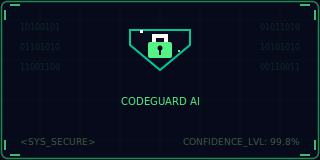
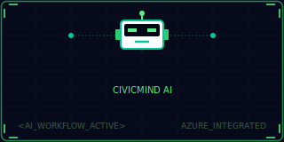
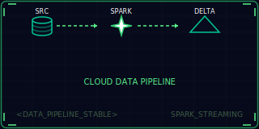
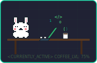

<!-- Top Unified Cyber Banner -->

 

<!-- Interactive-Looking Glassmorphic Action Buttons -->

 

---

## 👤 CHARACTER HUB &amp; STATUS

<table width="100%" border="0" cellpadding="0" cellspacing="0">
  <tr>
    <td width="48%" valign="top" style="border: none;">
      <h3>🎮 CHARACTER PROFILE</h3>
      <ul>
        <li><b>CLASS:</b> Aspiring Cloud-Native Data Engineer</li>
        <li><b>EDUCATION:</b> B.Tech Computer Science (Final Year)</li>
        <li><b>MAIN QUEST:</b> Building Scalable Data &amp; Intelligent AI Solutions</li>
        <li><b>INTERESTS:</b> Distributed Systems, AI Engineering, Cloud Architecture</li>
        <li><b>GUILD STATS:</b> Love solving real-world, high-scale engineering challenges</li>
      </ul>
       
      <h4>🎯 CURRENT GOAL</h4>
      <blockquote>
        Become a Cloud-Native Data Engineer building intelligent, ultra-scalable data platforms that run seamlessly in the cloud.
      </blockquote>
    </td>
    <td width="4%" style="border: none;"></td>
    <td width="48%" valign="top" style="border: none;">
      <h3>📊 DEVELOPER STATS</h3>
      
    </td>
  </tr>
</table>

 

---

## ⚔️ INVENTORY (TECH STACK)

<table width="100%">
  <tr>
    <td width="25%"><b>LANGUAGES</b></td>
    <td>
      
      
      
      
    </td>
  </tr>
  <tr>
    <td><b>WEB FRAMEWORKS</b></td>
    <td>
      
      
      
    </td>
  </tr>
  <tr>
    <td><b>DATA ENGINEERING</b></td>
    <td>
      
      
      
      
    </td>
  </tr>
  <tr>
    <td><b>CLOUD &amp; INFRASTRUCTURE</b></td>
    <td>
      
      
      
    </td>
  </tr>
  <tr>
    <td><b>UTILITIES &amp; TOOLS</b></td>
    <td>
      
      
      
      
    </td>
  </tr>
</table>

 

---

## 🏆 FEATURED QUESTS (PROJECTS)

<table width="100%" border="0" cellpadding="10" cellspacing="0">
  <tr>
    <td width="33.3%" valign="top" style="border: 1px solid #1A253C; border-radius: 8px; padding: 12px; background: #050816;">
      
      <h4>🛡️ CodeGuard AI</h4>
      
AI-powered secure code analysis platform with intelligent vulnerability detection, confidence scoring, and reasoning engine.

      

        
        
        
      

    </td>
    <td width="33.3%" valign="top" style="border: 1px solid #1A253C; border-radius: 8px; padding: 12px; background: #050816;">
      
      <h4>🏛️ CivicMind AI</h4>
      
AI-powered citizen assistance platform integrating intelligent workflows, FastAPI backend, Azure cloud services, and MongoDB NLP pipelines.

      

        
        
        
      

    </td>
    <td width="33.3%" valign="top" style="border: 1px solid #1A253C; border-radius: 8px; padding: 12px; background: #050816;">
      
      <h4>📊 Cloud Data Pipeline</h4>
      
End-to-end ETL pipeline using Apache Spark, Delta Lake, Azure Data Lake Storage, and PostgreSQL for scalable real-time analytics.

      

        
        
        
      

    </td>
  </tr>
</table>

 

---

## 💻 CURRENT QUESTS &amp; GRID ACTIVITY

<table width="100%" border="0" cellpadding="0" cellspacing="0">
  <tr>
    <td width="40%" valign="top" style="border: none;">
      <h3>🎮 NOW LEVELING</h3>
      

        
      

       
      <ul>
        <li>⚡ <b>Learning Spark</b> &amp; PySpark internals</li>
        <li>☁️ <b>Mastering Azure</b> storage &amp; cloud pipelines</li>
        <li>🏗️ <b>Building projects</b> with Delta Lake</li>
        <li>🧠 <b>Improving DSA</b> &amp; system architecture skills</li>
        <li>🧹 <b>Writing cleaner code</b> &amp; scalable patterns</li>
        <li>☕ <b>Fuel:</b> Coffee + Code + Curiosity</li>
      </ul>
    </td>
    <td width="5%" style="border: none;"></td>
    <td width="55%" valign="top" style="border: none;">
      <h3>🐍 CONTRIBUTION GRID SNAKE</h3>
      

        <!-- Contribution Snake SVG automatically generated by Github Actions in the output branch -->
        
      

    </td>
  </tr>
</table>

 

---

▰▰▰▰▰▰▰▰▰▰▰▰▰▰▰▰▰▰▰▰▰▰▰▰▰▰▰▰▰▰▰▰▰▰▰▰▰▰▰▰▰▰▰▰▰▰▰▰▰▰▰▰▰▰▰▰▰▰▰▰▰▰▰▰▰▰▰▰▰▰▰▰▰▰▰▰▰▰▰▰▰▰▰

#### 💭 PHILOSOPHY
> **"Don't just write code. Build systems that solve real-world problems and scale."**

Thank you for visiting! 🌈

