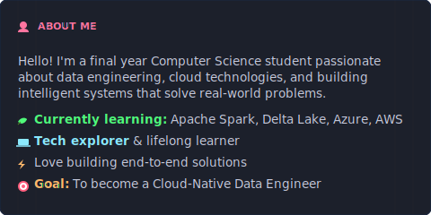
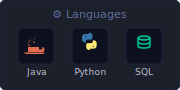
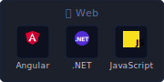
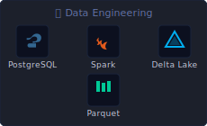
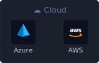
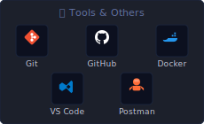
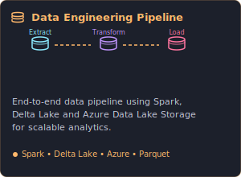

<!-- Top Retro Cyber Banner -->

<!-- Left-aligned Action Buttons below the banner elements -->

  &nbsp;&nbsp;&nbsp;&nbsp;&nbsp;&nbsp;&nbsp;&nbsp;
  
  &nbsp;
  
  &nbsp;
  
  &nbsp;
  

 

<!-- Row 2: About Me & GitHub Stats Cards -->
<table width="100%" border="0" cellpadding="0" cellspacing="0">
  <tr>
    <td width="48%" valign="top" style="border: none; padding: 0;">
      
    </td>
    <td width="4%" style="border: none;"></td>
    <td width="48%" valign="top" style="border: none; padding: 0;">
      
    </td>
  </tr>
</table>

 

<!-- Row 3: Tech Stack Inventory Header & Cards -->
<h2 align="left">&lt;/&gt; TECH STACK</h2>

  
  &nbsp;
  
  &nbsp;
  
  &nbsp;
  
  &nbsp;
  

 

<!-- Row 4: Featured Projects Header & Carousel Cards -->
<h2 align="left">🚀 FEATURED PROJECTS</h2>

<table width="100%" border="0" cellpadding="0" cellspacing="0">
  <tr>
    <td width="2%" align="center" valign="middle" style="border: none; font-size: 24px; color: #BD93F9; font-weight: bold; opacity: 0.5;">
      &lt;
    </td>
    <td width="31%" valign="top" style="border: none; padding: 4px;">
      
    </td>
    <td width="31%" valign="top" style="border: none; padding: 4px;">
      
    </td>
    <td width="31%" valign="top" style="border: none; padding: 4px;">
      
    </td>
    <td width="2%" align="center" valign="middle" style="border: none; font-size: 24px; color: #BD93F9; font-weight: bold; opacity: 0.5;">
      &gt;
    </td>
  </tr>
</table>

 

<!-- Row 5: GitHub Activity & Currently leveling Cards with peaking mascot -->
<table width="100%" border="0" cellpadding="0" cellspacing="0">
  <tr>
    <!-- Left: Activity Card with border and background to match Currently card -->
    <td width="48%" valign="top" style="border: 1.5px solid #1A253C; border-radius: 8px; padding: 16px; background: #050814;">
      

        ⚡ GITHUB ACTIVITY
      

      

        <!-- Contribution Snake Grid (Generated dynamically via Github Action) -->
        
      

      

        <!-- Sitting Cinnamoroll Mascot -->
        
      

    </td>
    <!-- Peaking Mascot column -->
    <td width="4%" align="center" valign="bottom" style="border: none; padding-bottom: 0;">
      
    </td>
    <!-- Right: Currently Card -->
    <td width="48%" valign="top" style="border: none; padding: 0;">
      
    </td>
  </tr>
</table>

 
 

<!-- Footer Section -->

  <!-- Glowing Quote Bar -->
  
   
  

    Thanks for visiting! Have a great day! 🌈
  

